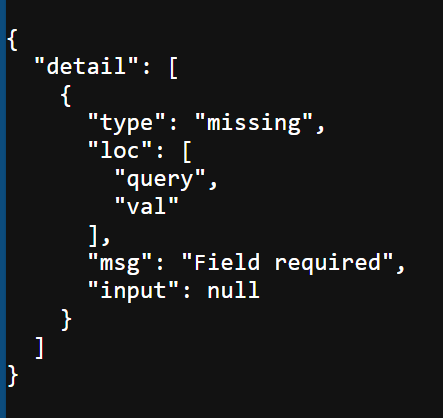

## error 1: 


---
# ERROR: 2

## 📥 Input Code
```python
def send_items(items: Body()):
# also this too 
def send_items(items: Body):
```

## 📤 Error Output
```python
fastapi.exceptions.FastAPIError: Invalid args for response field! Hint: check that annotation=NoneType required=True json_schema_extra={} is a valid Pydantic field type. If you are using a return type annotation that is not a valid Pydantic field (e.g. Union[Response, dict, None]) you can disable generating the response model from the type annotation with the path operation decorator parameter response_model=None. Read more: https://fastapi.tiangolo.com/tutorial/response-model/
```

## ✅ Solution
```diff
-def send_items(items: Body):
+def send_items(items: dict  = Body()):
OR
+def send_items(dict=Body()):
```

## 📝 Analysis
**Root Cause:** 
i tried to use Body() as a type. bruh. 
## 🔗 Resources
- N/A

---
# ERROR: 3

## 📥 Input Code
```python
fake_items_db = {
    "items": {
        {"id": str(uuid4()), "item_name": "balls"}, 
        {"id": str(uuid4()), "item_name": "Milk"}, 
        {"id": str(uuid4()), "item_name": "Cucumber"}
    }
}
```

## 📤 Error Output
```python
Set entry must be hashable
  Type "dict[str, str]" is not hashablePylancereportUnhashable

```

## ✅ Solution
```diff
-fake_items_db = {
+fake_items_db = [
    "items": {
        {"id": str(uuid4()), "item_name": "balls"}, 
        {"id": str(uuid4()), "item_name": "Milk"}, 
        {"id": str(uuid4()), "item_name": "Cucumber"}
    }
+]
-}
```

## 📝 Analysis
**Root Cause:** 
> use list of dicts. because using {{...}, {...}} is illegal
> so use [{...}, {...}, {...}] 


---
# ERROR: 4

## 📥 Input Code
```python
    fake_items_db.append(str(id))
```

## 📤 Error Output
```python
Argument of type "str" cannot be assigned to parameter "object" of type "dict[str, str]" in function "append"
```

## ✅ Solution
```diff
error
```

## 🔗 Resources
- N/A


---
# ERROR: 5

## 📥 Input Code
```python
fake_items_db = [
    "id": str(uuid4())
        { "item_name": "balls" }, 
    "id": str(uuid4())
        { "item_name": "milk"}, 
    "id": str(uuid4())
        { "item_name": "cucumber"}
]
```

## 📤 Error Output
```python
  File "/mnt/e/e-drive/coding/newnew/py/fastAPI/books-api/main.py", line 8
    "id": str(uuid4())
        ^
```

## ✅ Solution
```diff
fake_items_db = [{
    "id": str(uuid4()),
    "item_name": "balls", 
    },
    { 
    "id": str(uuid4()),
    "item_name": "gum"
    },
    {
    "id": str(uuid4()),
    "item_name": "broom"
    }
]
```

## 📝 Analysis
**Root Cause:** 
i didnt fucking know how to even put list of dicts properly and assign ONE KEY multiple vals for it

## 🔗 Resources
- https://www.scaler.com/topics/list-of-dictionaries-in-python/ 


---
# ERROR: 6

## 📥 Input Code
```python
    if not items["item_name"]:
        return {"message": "Invalid item name. Please try again loser", "status": "fail"}

```

## 📤 Error Output
```python
   File "/mnt/e/e-drive/coding/newnew/py/fastAPI/books-api/main.py", line 34, in send_item
    if not items["item_name"]:
           ~~~~~^^^^^^^^^^^^^
KeyError: 'item_name'
```

## ✅ Solution
```diff
-if not items["item_name"]:
+if "item_name" not in dict_name:
    return {"message": "Invalid item name. Please try again loser", "status": "fail"}
```

## 📝 Analysis
**Root Cause:** 

## 🔗 Resources
- gpt: 
> **🧠 Hint Level:**  
If you’re not gonna use `get()`, at least check `if "item_name" in items`. Because right now, your validation logic is like building a bridge and hoping the river doesn’t move.

---
# ERROR: 7

## 📥 Input Code
```python
❯ uv add icecream
```

## 📤 Error Output
```python
warning: `VIRTUAL_ENV=/mnt/e/e-drive/coding/newnew/py/fastAPI/books-api/.venv` does not match the project environment path `.venv` and will be ignored; use `--active` to target the active environment instead
```

## ✅ Solution
```diff

```

---
# ERROR: 8

## 📥 Input Code
```python
if __name__ == "__main__":
    uvicorn.run(
        app,
        "__main__:app", 
        host="0.0.0.0",
        port=22000, 
        log_level="info",
        reload=True,
    )   
```

## 📤 Error Output
```python
error
```

## ✅ Solution
```diff
if __name__ == "__main__":
    uvicorn.run(
-       app,
+       "__main__:app", 
        host="0.0.0.0",
        port=22000, 
        log_level="info",
        reload=True,
    )
```

## 🔗 Resources
- https://github.com/fastapi/fastapi/discussions/7449


---
# ERROR: 9

## 📥 Input Code
```python

```

## 📤 Error Output
```python
  File "/mnt/e/e-drive/coding/newnew/py/fastAPI/items-app/main.py", line 32, in MovieRequest
    name: str | None = Field(
                       ^^^^^
NameError: name 'Field' is not defined
```

## ✅ Solution
```diff
You never imported it dummy!
```
---
# ERROR: 10

## 📥 Input Code
```python
@app.get("/movies/{movie_id}")
async def get_single_movie(movie_id):
    for movie in movies_db:
        if movie["id"] == movie_id:
            print(type(movie))
            return movie
```

## 📤 Error Output
```python
TypeError: 'Movie' object is not subscriptable
```

## ✅ Solution
```diff
@app.get("/movies/{movie_id}")
async def get_single_movie(movie_id):
    for movie in movies_db:
+       if movie.id == movie_id:
-       if movie["id"] == movie_id:
            print(type(movie))
            return movie
```

## 📝 Analysis
**Root Cause:** 
## 🧠 Why?

Because `movie` is a **class instance**, not a dictionary.

And in Python:

-   Dictionaries use `["key"]` → ✅ `movie["id"]`
    
-   **Objects** (like instances of a class or Pydantic model) use **dot notation** → ✅ `movie.id`
    

So if you try to treat an object like a dictionary, you get that exact **TypeError**.

---
another type 
```python
if movie_id in movies_db[i]["id"]:
    pass
```

> fix
```python
-if movie_id in movies_db[i]["id"]:
    pass
+if movie_id in movies_db[i].id:
    pass
```

---
# ERROR: 11

## 📥 Input Code
```python
def check(rating: Path(default=1, le=1, ge=5, description="enter the rating to fetch movies") ):
```

## 📤 Error Output
```python
  File "/mnt/e/e-drive/coding/newnew/py/fastAPI/items-app/.venv/lib/python3.13/site-packages/fastapi/params.py", line 189, in __init__
    assert default is ..., "Path parameters cannot have a default value"
           ^^^^^^^^^^^^^^
AssertionError: Path parameters cannot have a default value
```

## ✅ Solution
```diff
-def check(rating: Path(default=1, le=1, ge=5, description="enter the rating to fetch movies") ):
+def check(rating: Path(le=1, ge=5, description="enter the rating to fetch movies") ):
```
fix

## 📝 Analysis
**Root Cause:** 
description

## 🔗 Resources
- N/A


---
# ERROR: 12

## 📥 Input Code
```python
def check(rating: Path( le=1, ge=5, description="enter the rating to fetch movies") ):
```

## 📤 Error Output
```python
fastapi.exceptions.FastAPIError: Invalid args for response field! Hint: check that annotation=NoneType required=True description='enter the rating to fetch movies' json_schema_extra={} is a valid Pydantic field type. If you are using a return type annotation that is not a valid Pydantic field (e.g. Union[Response, dict, None]) you can disable generating the response model from the type annotation with the path operation decorator parameter response_model=None. Read more: https://fastapi.tiangolo.com/tutorial/response-model/
```

## ✅ Solution
```diff
-def check(rating: Path( le=1, ge=5, description="enter the rating to fetch movies") ):
+def check(rating: int = Path( le=1, ge=5, description="enter the rating to fetch movies") ):
```
fix

## 📝 Analysis
**Root Cause:** 
add a fucking type and ASSSIGN ITT WITH AN '='

## 🔗 Resources
- N/A

---
# ERROR: 13

## 📥 Input Code
```python
    raise HTTPException(status_code=404, detail="Movie not found! Check ID and try again")
```

## 📤 Error Output
```python
    ^
  File "/mnt/e/e-drive/coding/newnew/py/fastAPI/items-app/.venv/lib/python3.13/site-packages/fastapi/routing.py", line 212, in run_endpoint_function
    return await dependant.call(**values)
           ^^^^^^^^^^^^^^^^^^^^^^^^^^^^^^
  File "/mnt/e/e-drive/coding/newnew/py/fastAPI/items-app/main.py", line 100, in get_single_movie
    raise HTTPException(status_code=404, message="Movie not found! Check ID and try again")
          ~~~~~~~~~~~~~^^^^^^^^^^^^^^^^^^^^^^^^^^^^^^^^^^^^^^^^^^^^^^^^^^^^^^^^^^^^^^^^^^^^
TypeError: HTTPException.__init__() got an unexpected keyword argument 'message'
```

## ✅ Solution
```diff
-   raise HTTPException(status_code=404, message="Movie not found! Check ID and try again")
+   raise HTTPException(status_code=404, detail="Movie not found! Check ID and try again")
```

---
# ERROR: 14

## 📥 Input Code
```python
@app.put('/update-movie', status_code=200)
async def update_movie(movies: MovieRequest):
    for i in range(len(movies_db)):
        print(f'{movies.id=}');
        if movies.id == movies_db[i].id:
            movies_db[i] = movies 
                # do something
```

## 📤 Error Output
```python
INFO:     127.0.0.1:47992 - "GET /movies?offset=0&limit=10 HTTP/1.1" 200 OK
movie.id=UUID('8cb25c58-563c-4d53-97c4-e0379da5933d')
movie.id=UUID('8cb25c58-563c-4d53-97c4-e0379da5933d')
movie.id=UUID('8cb25c58-563c-4d53-97c4-e0379da5933d')
movie.id=UUID('8cb25c58-563c-4d53-97c4-e0379da5933d')
```

## ✅ Solution
```diff
@app.put('/update-movie', status_code=200)
async def update_movie(movies: MovieRequest):
    for i in range(len(movies_db)):
+       if str(movies.id) == movies_db[i].id:
-       if movies.id == movies_db[i].id:
            movies_db[i] = movies 
                # do something
```

## 📝 Analysis
**Root Cause:** 
> ALWAYS FUCKING STRINGIFY THE UUIDS since its return instance will never match to the inMEM DB